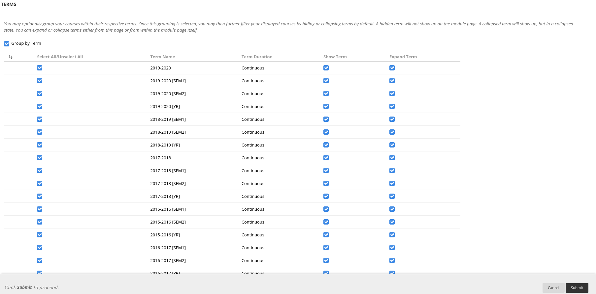
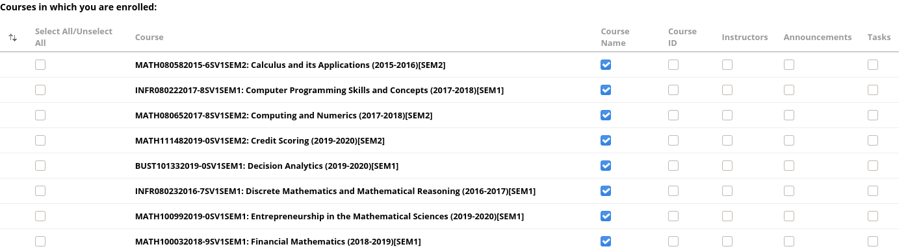
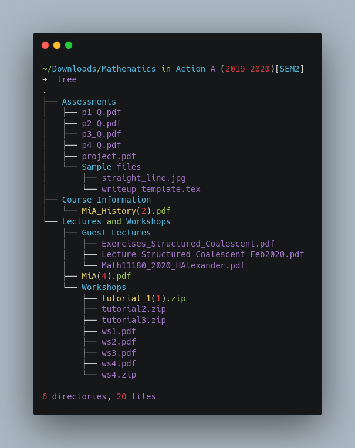

# learn-scraper

Download all files from all courses enrolled as a student in [Learn](https://www.learn.ed.ac.uk). Requires [Python 3.8.x](https://www.python.org/downloads/).

## Installation

* Clone this repo.

* Install `pipenv` by running the following command: ```pip install --user pipenv```

* `cd` into the repo, and run the following command: ```pipenv install```

## Configuration

* Copy `config.py.template` and rename it as `config.py`: ```cp config.py.template config.py```

* Replace placeholder values in `config.py` with user-specific ones.

## Usage

* Login to [Learn](https://www.learn.ed.ac.uk) via your browser.

* Click on the `Manage Course List` button, as shown below:  


* Under the `TERMS` tab, tick all `Select All/Unselect All` checkboxes, as shown below:  

`

* Scroll down to the `Courses in which you are enrolled` tab, and tick *at least* one checkbox for each course whose materials you wish to bulk download. For example:  



* Click the `Submit` button on the bottom-right corner to finalise your changes.

* `cd` into the repo (if you're not there already), activate the virtual environment (by running ```pipenv shell```) and run the following command: ```python scraper.py```

## Result

* Files are saved to `DOWNLOAD_DIR` following the folder structure in each course page (see below):  



## Troubleshooting

### `ModuleNotFoundError`

* If the above command doesn't work, try ```pipenv run python scraper.py``` instead.

### `command not found: pipenv`

* ```pip install --user pipenv``` installs `pipenv` under `$HOME/.local/bin` by default, so make sure this is in your `$PATH`. See [here](https://opensource.com/article/17/6/set-path-linux) for more details.

### `pkg_resources.DistributionNotFound`

* Delete `Pipfile.lock`: ```rm Pipfile.lock```

* Delete the installed virtual environment by running the following command: ```pipenv --rm```

* Rerun ```pipenv install```, activate it once finished (```pipenv shell```) and then run the script: ```python scraper.py```

### `NotADirectoryError`

* This is most likely because a folder or file name contains [reserved characters](https://en.wikipedia.org/wiki/Filename#Reserved_characters_and_words). This should now be fixed.

